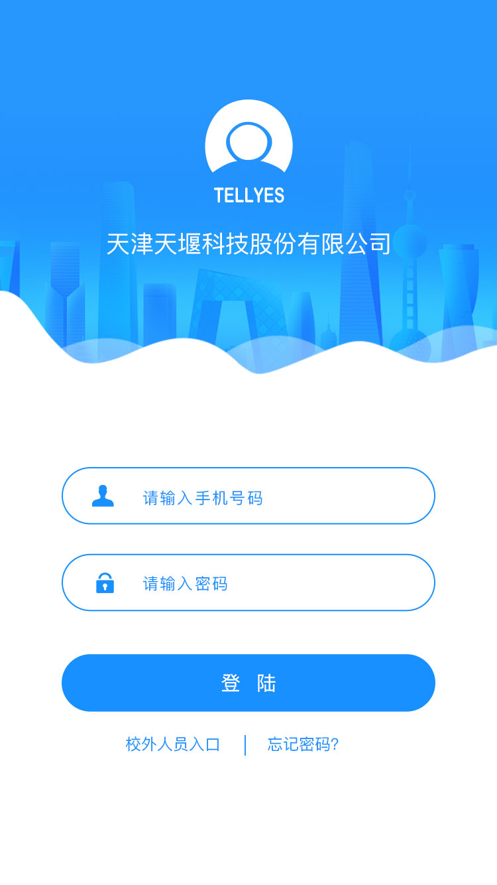

# jQuery WeUI - 基于 jQuery 打造的 WEUI

jQuery WeUI 是专为微信公众账号开发而设计的一个简洁而强大的 UI 库，包含全部 WeUI 官方的 CSS 组件，并且额外提供了大量的拓展组件，丰富的组件库可以极大减少前端开发时间。

更多文档请参阅官网： [http://jqweui.com/](http://jqweui.com/)

# 为什么选择 jQuery WeUI

- 简单易用，无上手难度
- 丰富强大的组件库，并且还在不断完善中
- 轻量，无限制，可以结合任何主流 JS 框架使用，比如 `Vue, Angular, React` 等
- 高性能的 CSS3 动画，低端手机上依然可以较流畅运行
- 详尽完善的官方文档
- 稳定的 API，不间断的更新迭代

# 搭配框架

`jQuery WeUI` 的定位正如 `jQuery` 的定位：做一把锋利的小刀，而不是做一个笨重的大炮。

`jQuery WeUI` 只是提供一些常用的 UI 控件，如果不是很复杂的项目，基本只用 `jQuery WeUI` 即可满足需求。如果项目比较复杂，或者希望实现单页应用，推荐使用 [Vue](https://github.com/vuejs/vue/) 或者 [Angular](https://angular.io/)，或者可以看看我正在开发的另一个项目 [vue-mobile](https://github.com/lihongxun945/vue-mobile)

# 下载

推荐通过 npm 来安装 `npm install jquery-weui`

或者你可以 clone 这个仓库，自行编译，关于如何进行编译请参见下面的 gulp 章节。

所有编译后的代码都在 `dist` 目录下，为了减少垃圾文件，master 默认忽略了这个目录，你可以自行编译或者切换到 `build` 分支就可以看到这个目录。

# gulp

使用 `gulp` 进行代码编译，如果你没有用过或者不想自行编译，可以切换到 `build` 分支即可。

关于如何使用 gulp 请参考 [http://gulpjs.com/](http://gulpjs.com/)

可用的 gulp 命令如下：

- `gulp` 进入开发模式，同时打开 `watch` 和 `server`任务
- `gulp build` 编译压缩代码

# LICENSE

[MIT](https://opensource.org/licenses/MIT)，尽情享受开源代码。

# Thanks

- [WeUI](http://weui.github.io/weui/#/)
- [Framework7](http://framework7.io/)
- [MSUI](http://m.sui.taobao.org/)
- [Jekyll](http://jekyllrb.com/)
- [gulp](http://gulpjs.com/)

# 页面效果规范展示

# 组件展示

